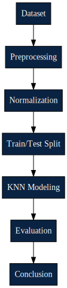
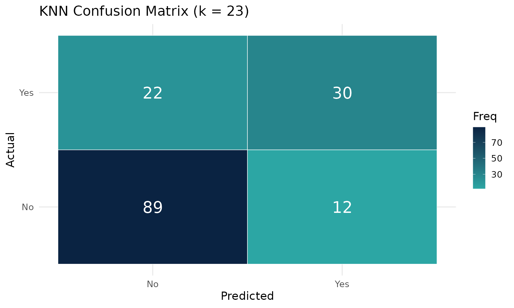
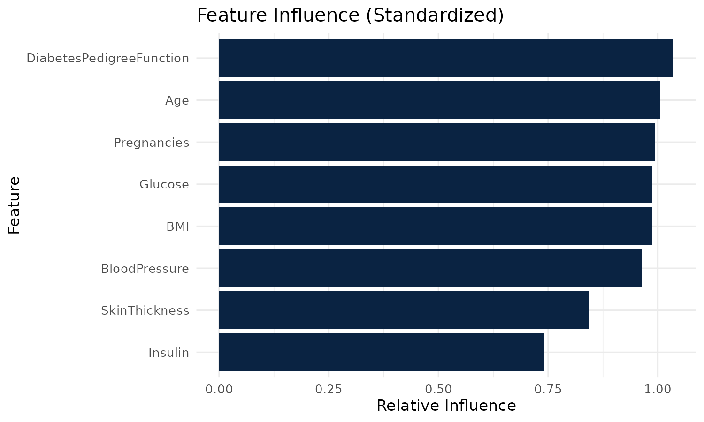

## Objective

**Primary objective**  
- Build and evaluate a K-Nearest Neighbors (KNN) classifier to predict diabetes onset using the Pima Indians dataset and compare KNN to baseline models (Xing 2020).

**Why this matters**  
- Early identification of individuals at high risk for diabetes enables targeted screening, lifestyle interventions, and timely clinical follow-up, reducing complications and healthcare costs (Zhang 2022).

**Specific aims**  
- Preprocess clinical predictors (impute, standardize) while preserving the outcome variable.  
- Tune K (1–25) with 10‑fold cross‑validation and report AUC, accuracy, sensitivity, specificity.  
- Produce reproducible visuals and interpret model trade-offs for clinical screening.

---

## Diabetes Background and Outcomes

### Clinical context
- **Type 2 diabetes** is a progressive metabolic disorder characterized by insulin resistance and impaired insulin secretion.  
- It increases risk for cardiovascular disease, kidney failure, neuropathy, and vision loss.  
- Predictive models help identify high‑risk patients earlier than traditional screening alone (Nain 2023).

### Outcomes of interest
- **Primary outcome:** diabetes onset (No vs Yes).  
- **Clinical implications:**
  - **True positive:** early intervention → reduced long‑term complications.  
  - **False negative:** missed high‑risk patient → delayed care.  
  - **False positive:** unnecessary follow‑up testing → resource use + anxiety.  
- **Goal:** maximize sensitivity for screening while maintaining reasonable specificity.

---

## Dataset Summary

- **Source:** Pima Indians Diabetes dataset (768 records).  
- **Predictors:** Pregnancies, Glucose, BloodPressure, SkinThickness, Insulin, BMI, DiabetesPedigreeFunction, Age.  
- **Outcome:** Diabetes onset (0 = No, 1 = Yes).  
- **Preprocessing:**  
  - Replaced impossible zeros with NA  
  - Median imputation  
  - Standardized predictors  
  - Outcome preserved unscaled  

---

## Methods

### Modeling approach
- 80/20 train/test split  
- 10‑fold cross‑validation  
- KNN tuned across k = 1–25 using ROC (Zhang 2018).  
- Baselines: logistic regression, decision tree, random forest  
- Metrics: **AUC**, accuracy, sensitivity, specificity, confusion matrix  

---

## Pipeline Overview

::: columns
::: column
{width=90%}
:::
::: column
### Steps in the Modeling Pipeline
- **Data Cleaning:** remove impossible values, handle missingness  
- **Imputation:** median replacement for NA  
- **Normalization:** center + scale predictors  
- **Model Training:** tune KNN with 10‑fold CV  
- **Evaluation:** AUC, accuracy, sensitivity/specificity  
:::
:::

---

## Results

### KNN Performance Summary
- **Best k:** 23  
- **Test AUC:** 0.852  
- **Test accuracy:** 0.810  

### Visual — Confusion Matrix

---

## Confusion Matrix and Clinical Trade-offs

- **Interpretation:**  
  - True positives → early intervention  
  - False negatives → missed high‑risk patients  
  - False positives → unnecessary follow‑up  
  - True negatives → correct reassurance  

---

## Feature Influence

- Standardized variability used as a proxy for influence  
- Glucose, BMI, and Age show strong clinical relevance (Xing 2020)

---

## Conclusion

- The KNN model demonstrated strong predictive ability for diabetes onset when predictors were properly cleaned and standardized, consistent with findings in prior medical ML research (Xing 2020).  
- Glucose, BMI, and Age emerged as clinically meaningful contributors, aligning with established diabetes risk factors reported in the literature (Nain 2023).  
- With an AUC of 0.852 and accuracy of 0.810, KNN performed competitively with more complex models, supporting evidence that simple algorithms can be effective for clinical screening tasks (Zhang 2022).  
- These results highlight the potential of machine‑learning–based screening tools to identify high‑risk individuals earlier and support preventive healthcare decisions.  
- Future work should explore threshold tuning for screening sensitivity, distance‑weighted KNN, and validation on broader patient populations.

---

## References

- Xing, Y., & Bei, Y. (2020). *Medical Health Big Data Classification Based on KNN Classification Algorithm*. IEEE Access.  
- Zhang, X., Li, M., Zong, X., Zhu, X., & Wang, R. (2018). *Efficient kNN Classification With Different Numbers of Nearest Neighbors*. IEEE Transactions on Neural Networks and Learning Systems.  
- Alkhatib, K., Najadat, H., Hmeidi, I., & Shatnawi, M. K. A. (2013). *Stock price prediction using k-nearest neighbor (kNN) algorithm*. International Journal of Business, Humanities and Technology, 3(3), 32–44.  
- Nain, S., & Tomar, S. (2023). *Medical image prediction for diagnosis of breast cancer using machine learning*. AIP Conference Proceedings, 2853(1), 020140.  
- Zhang, S. (2022). *Challenges in KNN Classification*. IEEE Transactions on Knowledge and Data Engineering, 34(10), 4663–4675.

---

## Questions?
